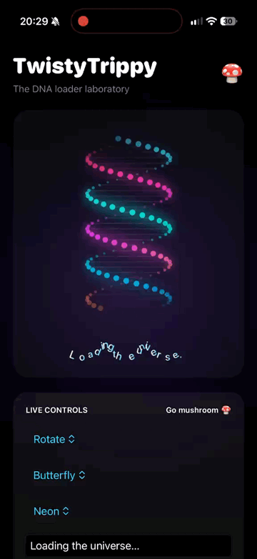

# TwistyTrippy 🧬🍄

**Twist it. Trip it. Repeat.**

A customizable SwiftUI DNA loader with glowing gradients, playful text effects, and an interactive demo playground.

**iOS 17+ · Swift 5.9+ · Zero dependencies**



<!-- Add screenshots at these paths, then uncomment:


-->
*More screenshots coming soon.*

## Features

- Six DNA motions, from a gentle breath to psychedelic mushroom mode.
- Eight text styles, including waves, butterflies, typewriter, and shimmer.
- Four built-in themes plus custom solid colors and multi-stop strand gradients.
- Independent DNA and text speeds, adjustable twists, particle density, glow, and connecting rungs.
- Fixed, container-relative, and adaptive helix sizing.
- Canvas rendering, TimelineView animation, and accessible loading labels.
- Standalone animated text and SwiftUI previews for the loader, text effects, and playground.

## Installation

In Xcode, choose **File → Add Package Dependencies…** and enter:

```text
https://github.com/imolowkey/TwistyTrippy
```

Choose the **Branch** dependency rule with `main`, then add the **TwistyTrippy** library to your app target. Requires Xcode 15 or later and an iOS deployment target of 17.0 or later.

The package is distributed directly from this Git repository; no separate registry publication is needed.

For another Swift package, add the dependency and product to your manifest:

```swift
// In Package(...):
dependencies: [
    .package(url: "https://github.com/imolowkey/TwistyTrippy.git", branch: "main")
],
targets: [
    .target(
        name: "YourTarget",
        dependencies: [.product(name: "TwistyTrippy", package: "TwistyTrippy")]
    )
]
```

## Quick start

```swift
import SwiftUI
import TwistyTrippy

struct LoadingView: View {
    var body: some View {
        TwistyTrippy()
            .frame(width: 280, height: 400)
            .background(.black)
    }
}
```

The loader fills its proposed container and centers the helix and optional message. Give it a frame when placing it in a stack or scroll view.

## Animations and speed

Use these snippets inside a SwiftUI `body` with `import SwiftUI` and `import TwistyTrippy`:

```swift
TwistyTrippy(
    animation: .mushroom,
    theme: .psychedelic,
    speed: 1.6,
    text: "Entering hyperspace…",
    textAnimation: .butterfly,
    textSpeed: 0.8
)
.frame(width: 300, height: 440)
.background(.black)
```

`speed` controls DNA motion; `textSpeed` independently controls lettering. `1` is normal speed, values above `1` are faster, and `0` freezes that effect at its initial phase. Negative speeds are treated as zero. Use `.reverse` for reverse DNA motion. `.still` stops DNA motion while text can continue animating.

## Gradients and glow

```swift
TwistyTrippy(
    animation: .ripple,
    theme: TrippyTheme(
        front: .gradient([.cyan, .mint, .blue]),
        back: .solid(.pink),
        rungs: .mint,
        glow: 12,
        particleSize: 4
    ),
    twists: 3,
    strands: 90,
    showsRungs: true,
    text: "Finding a new frequency…",
    textGradient: [.pink, .yellow, .mint]
)
.frame(width: 320, height: 440)
.background(.black)
```

Strand gradients interpolate along the helix. Mushroom mode also cycles their colors over time. Text gradients are applied to each character. Built-in themes: `.neon`, `.aurora`, `.fire`, and `.psychedelic`.

## Standalone text effects

```swift
AnimatedTrippyText(
    text: "Loading the universe…",
    animation: .shimmer,
    speed: 1.2,
    gradient: [.cyan, .pink, .yellow],
    font: .system(size: 20, weight: .bold, design: .rounded)
)
.padding()
.background(.black)
```

`AnimatedTrippyText` exposes `text`, `animation` (default `.wave`), `speed` (`1`), `gradient` (`[.white, .cyan]`), and `font` (16-point medium rounded system font).

## Responsive and fixed sizing

Sizing controls the **helix canvas**, not the whole view. Allow extra container height for the message and spacing, or pass `text: nil` to hide it.

```swift
VStack {
    // 50% of the container width and 65% of its height.
    TwistyTrippy(sizing: .relative(width: 0.5, height: 0.65))
        .frame(height: 360)

    // A fixed 150 × 240 helix inside a larger container.
    TwistyTrippy(sizing: .fixed(width: 150, height: 240))
        .frame(width: 260, height: 320)

    // Grows with the container up to these limits.
    TwistyTrippy(sizing: .adaptive(maxWidth: 180, maxHeight: 280))
        .frame(height: 380)
}
.frame(maxWidth: .infinity)
.background(.black)
```

Relative fractions are clamped to `0...1` and use the parent container, not the device screen. Adaptive sizing uses 56% of container width and 58% of container height, capped by `maxWidth` and `maxHeight` (defaults: `210` and `360`). Fixed and relative dimensions have a minimum of 1 point.

## Customization reference

All of these are public `TwistyTrippy` initializer arguments and mutable properties:

| Option | Default | Controls |
| --- | --- | --- |
| `animation: DNAAnimation` | `.rotate` | DNA motion |
| `sizing: TrippySizing` | `.adaptive()` | Helix canvas dimensions |
| `theme: TrippyTheme` | `.neon` | Strand colors, rungs, glow, and particles |
| `speed: Double` | `1` | DNA animation speed |
| `twists: Double` | `2.5` | Helix turns; minimum `0.25` |
| `strands: Int` | `64` | Sampling density along the two strands; clamped to `16...180` |
| `showsRungs: Bool` | `true` | Draw connecting lines |
| `text: String?` | `"Loading…"` | Message; `nil` or `""` hides it |
| `textAnimation: TrippyTextAnimation` | `.wave` | Letter animation |
| `textSpeed: Double` | `1` | Letter animation speed |
| `textGradient: [Color]` | `[.white, .cyan]` | Per-character gradient; empty falls back to white |
| `textFont: Font` | `.system(size: 16, weight: .medium, design: .rounded)` | Letter font |
| `spacing: CGFloat` | `20` | Gap between helix and text |

**DNAAnimation:** `.rotate`, `.reverse`, `.breathe`, `.ripple`, `.mushroom`, `.still`.

**TrippyTextAnimation:** `.none`, `.jumping`, `.butterfly`, `.wave`, `.pulse`, `.typewriter`, `.shimmer`, `.mushroom`.

**TrippyTheme** accepts public `front: TrippyInk`, `back: TrippyInk`, `rungs: Color`, `glow: CGFloat`, and `particleSize: CGFloat` properties and initializer arguments. Defaults are front `.gradient([.cyan, .mint, .blue])`, back `.gradient([.pink, .purple, .orange])`, white rungs, glow `8`, and particle size `3.6`.

**TrippyInk** supports `.solid(Color)` and `.gradient([Color])`. An empty palette falls back to white; a single color stays solid. Its public `color(at:)` method samples the palette at a clamped `0...1` position.

## Run the sample app

1. Clone this repository and open `TwistyTrippy.xcodeproj`.
2. Select the **TwistyTrippy** scheme and an iPhone or iPad simulator.
3. Run with **⌘R**. For a physical device, select your signing team first.

The demo links the package at the repository root. Its interactive playground controls motion, themes, message, speeds, twists, width, and rungs. Open `PlaygroundView.swift` for the interactive preview; loader and text previews remain alongside their package sources.

```text
Package.swift
Sources/TwistyTrippy/       # Reusable views and configuration
TwistyTrippy/              # Demo app, playground, and assets
TwistyTrippy.xcodeproj/    # Demo project with a local package dependency
```

---

Made by **Mohi** · [leoio.com](https://leoio.com)
